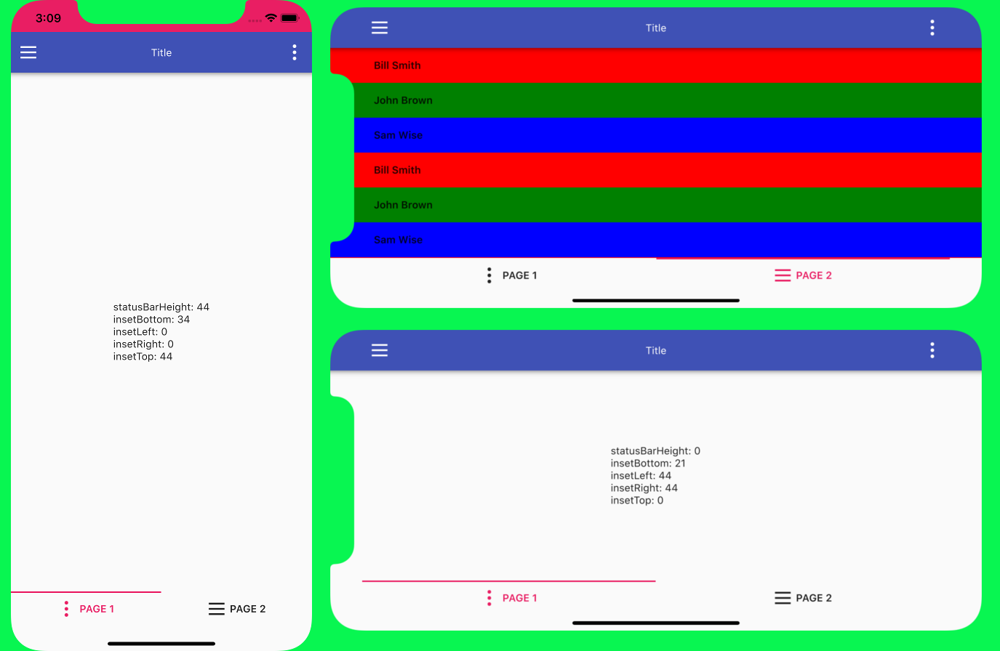
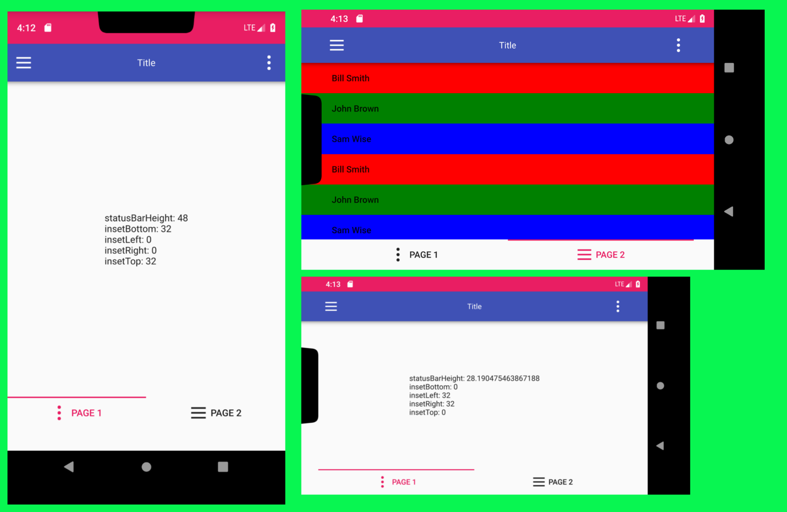
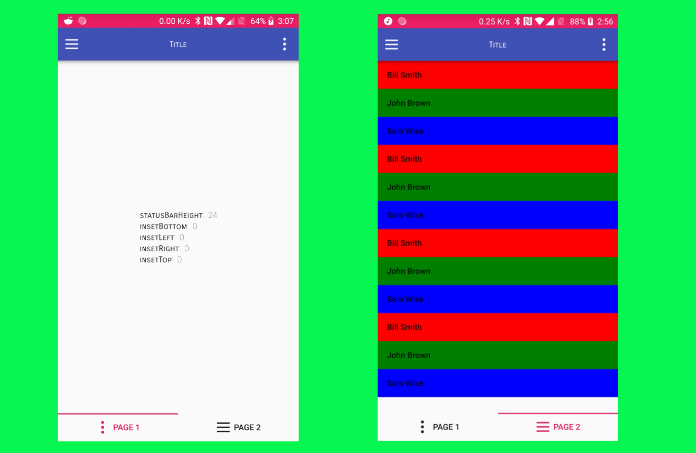

Introduction
------------

Simple api for getting insets for ios(notch) and android(cutout).

Usage
---------------

- git clone https://github.com/typedefalex/native_dimention.git

- add to main .pro file 
  `include(../../src/nativedimension.pri)`
- Use `NativeDimention::init(&engine)` after `QGuiApplication()` instance and before `QQmlApplicationEngine::load()` function.
  
  ```
  QGuiApplication app(argc, argv);
  QQmlApplicationEngine engine;
  ...
  NativeDimention::init(&engine);
  ...
  engine.load(QUrl(QStringLiteral("qrc:/main.qml")));
  ```
- add to qml file `import com.yas.NativeDimention 1.0`

Available 5 properties:

- NativeDimention.statusBarHeight
- NativeDimention.insetBottom
- NativeDimention.insetLeft
- NativeDimention.insetRight
- NativeDimention.insetTop
  
 Examples
--------------- 
https://github.com/typedefalex/native_dimention/tree/master/example/notchQtExample

Pay attention! For Android app we need use banch of code like onCreate method of NativeDimension.java class from example.

Screenshots
-----------







