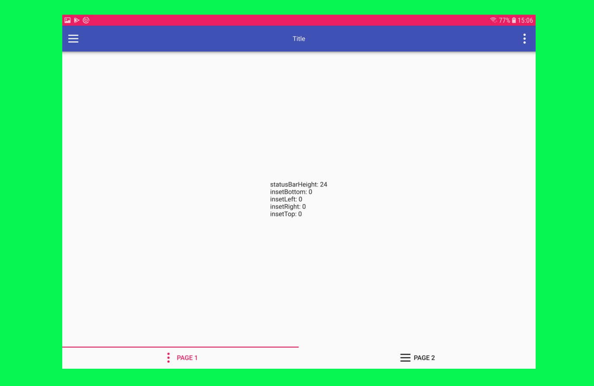

# native_dimention

Introduction
------------

Simple api to getting insets for ios(notch) and for android(cutout).

Usage
---------------

- git clone https://github.com/typedefalex/native_dimention.git

- add to main .pro file 
`include(../../src/nativedimension.pri)`

Screenshots
-----------

